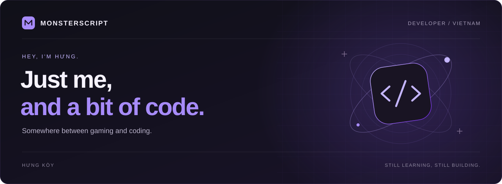
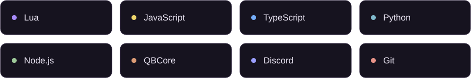

  

 

## A little about me

Hey, I'm **Hưng**, also known as **Hưng Kòy** — a developer from **Vietnam**.

I like figuring out how software works, trying out ideas, and making little tools that save a few extra clicks. Games are often where those ideas start.

For me, coding is a mix of curiosity, problem-solving, and the satisfaction of finally getting something to work.

 

## What keeps me curious

- **Games & their systems** — the things happening behind the screen.
- **Automation** — making repetitive tasks a little less repetitive.
- **How things work** — digging into a problem and learning along the way.

 

## Things I use

  

 

> Most of my projects are private for now — mainly game tools, FiveM scripts, and Discord automation. Just a small glimpse of what I spend my time on.

 

  <b>HƯNG KÒY</b> &nbsp; / &nbsp; Still learning, still building.

